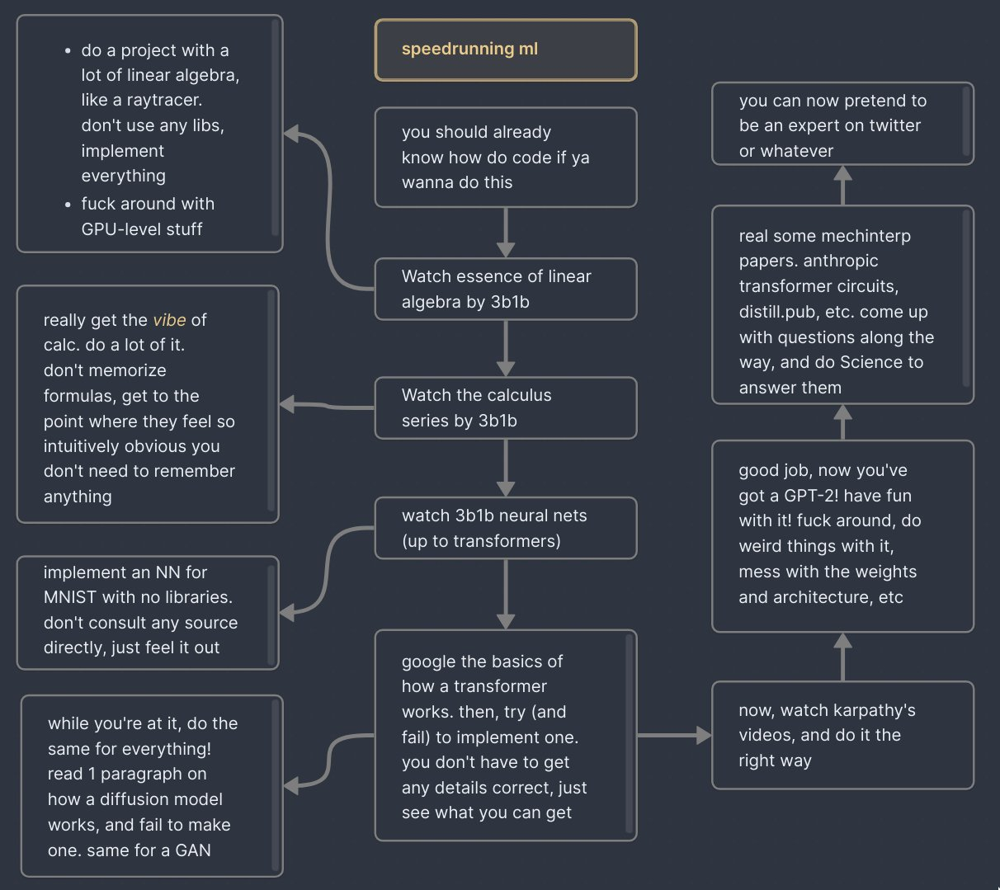

# raytracy

Building a raytracer following ["Ray Tracing in One Weekend — The Book Series"](https://raytracing.github.io/)

Following  courtesy of [@arithmoquine](https://x.com/arithmoquine) on Twitter, I am now building a raytracer from scratch called [raytracy](https://github.com/irfanzainudin/raytracy).